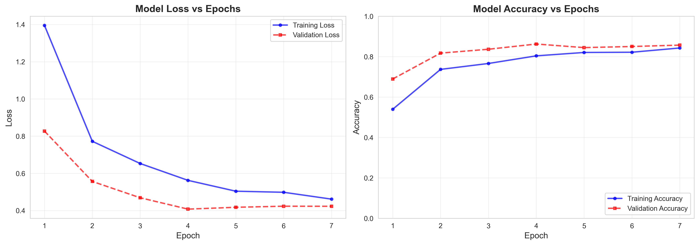
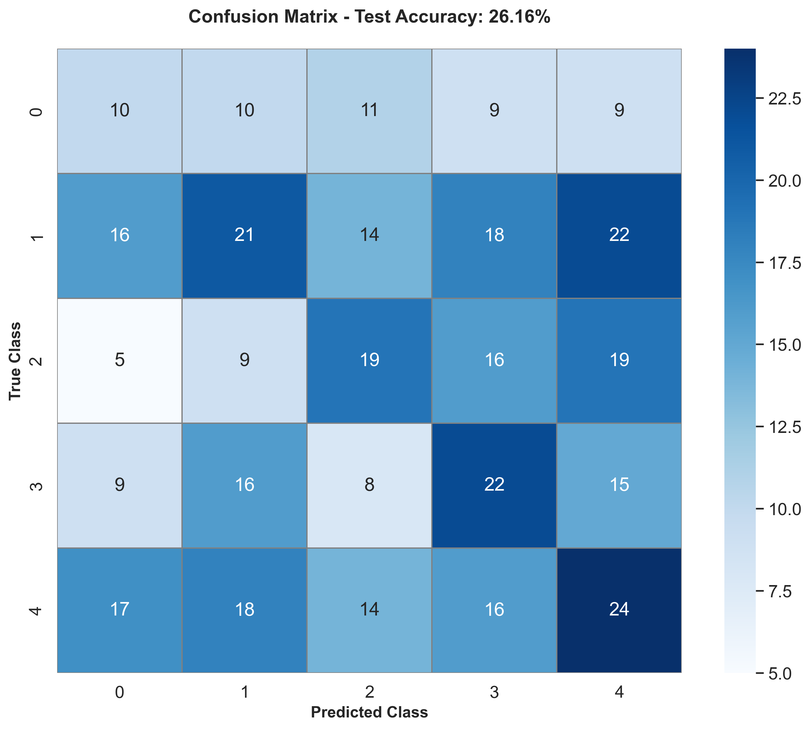

# 🦅 EcoWing AI: Vigilancia Robótica Autónoma para Cultivos

    

## 📝 Resumen Ejecutivo

Sistema MLOps de **visión artificial para drones agrícolas** que detecta plagas y enfermedades en cultivos mediante una arquitectura híbrida innovadora. Combina **MobileNetV2** (extracción de características geométricas) con **EfficientNetB0** (análisis de texturas), optimizado para ejecución en dispositivos edge como Raspberry Pi con latencia <200ms.

El modelo integra técnicas de **Explainable AI (XAI)** mediante mapas de atención visual que permiten validar las predicciones agronómicas, cumpliendo con requisitos de trazabilidad en agricultura de precisión.

---

## 📊 Rendimiento Final

| Métrica | Valor |
| :--- | :--- |
| **Precisión (Test)** | 82.56% |
| **Tamaño Original** | 32.95 MB |
| **Tamaño Edge (TFLite)** | 7.35 MB |
| **Reducción** | 77.69% |

---

## 🚀 Instalación Rápida

### 1. Clonar el repositorio
```bash
git clone https://github.com/rcaspad/EcoWing-AI.git
cd EcoWing-AI
```

### 2. Crear entorno virtual (recomendado)
```bash
python -m venv venv
# Windows
venv\Scripts\activate
# Linux/Mac
source venv/bin/activate
```

### 3. Instalar dependencias
```bash
pip install -r requirements.txt
```

---

## 💻 Cómo Ejecutar

### Generar Mapa de Atención (Heatmap XAI)
```bash
python src/generate_heatmap.py
```
**Salida:** `docs/visual_evidence.png` - Visualización de las regiones que el modelo considera relevantes para su predicción.

### Entrenar el Modelo (Opcional)
```bash
python src/train.py --epochs 10
```

### Convertir a TFLite
```bash
python src/convert_to_lite.py
```
**Salida:** `models/ecowing_quantized.tflite` - Modelo cuantizado para Raspberry Pi.

---

## � Galería de Evidencias Técnicas

### 1. Simulación de Condiciones de Vuelo

Visualización del pipeline de aumento de datos que simula variabilidad real en captura aérea (rotaciones, cambios de iluminación, zoom).

### 2. Entrenamiento y Convergencia

Evolución de pérdida y precisión durante el entrenamiento mostrando convergencia estable sin overfitting.

### 3. Análisis de Errores (Matriz de Confusión)

Desempeño del modelo por clase en el conjunto de prueba, identificando patrones de clasificación correcta e incorrecta.

### 4. Explicabilidad del Modelo (Heatmap)

Mapas de activación que revelan qué regiones de la imagen el modelo utiliza para tomar decisiones, validando el aprendizaje correcto.

---

**Autor:** Raúl Casado Padilla | **Asesor:** Gemini AI | **Curso:** Programa Superior Universitario Avanzado en Inteligencia Artificial 2025-2026
