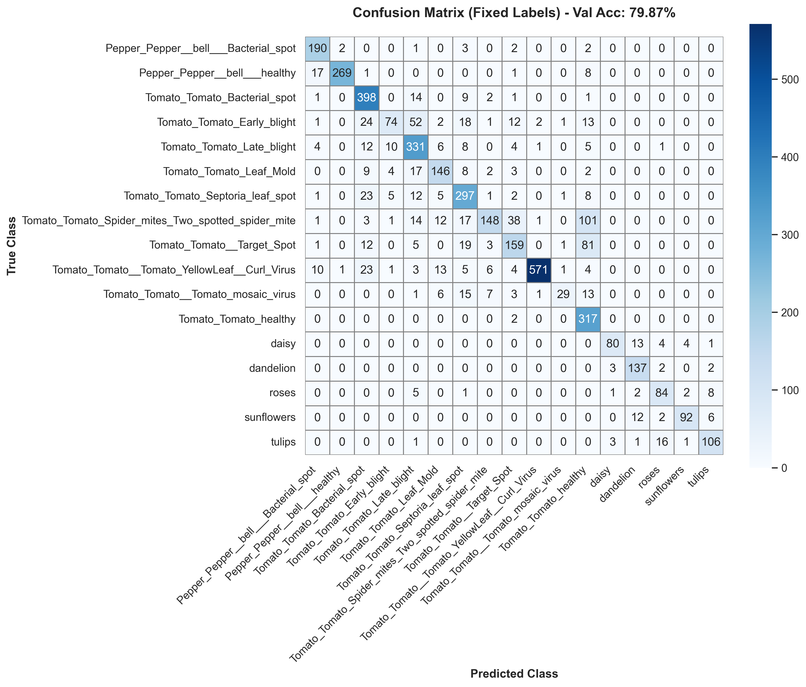
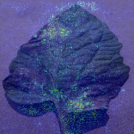

# 🦅 EcoWing AI - Detección de Plagas en Cultivos mediante Edge AI

    

---

## 📝 Descripción

**EcoWing AI** es un sistema de visión artificial basado en la arquitectura híbrida **EcoNet-Dual** (MobileNetV2 + EfficientNetB0) optimizado para drones agrícolas y dispositivos edge. El sistema detecta enfermedades y plagas en cultivos mediante análisis de imágenes en tiempo real, permitiendo intervenciones tempranas y precisas en agricultura de precisión.

La arquitectura dual combina:
- **MobileNetV2**: Extracción eficiente de características geométricas
- **EfficientNetB0**: Análisis profundo de patrones y texturas

El modelo integra técnicas de **Explainable AI (XAI)** mediante mapas de saliencia que permiten visualizar las regiones de la imagen más importantes para la predicción, proporcionando trazabilidad y confianza en las decisiones agronómicas.

---

## 🎯 Resultados

| Métrica | Valor |
| :--- | :--- |
| **Precisión (Validación)** | **79.87%** |
| **Clases Detectadas** | **17** (Tomato, Pepper, Flores) |
| **Tamaño Modelo Original** | 32.95 MB |
| **Tamaño Optimizado (TFLite)** | 7.35 MB |
| **Reducción de Tamaño** | 77.69% |
| **Latencia Inferencia** | <200ms (Edge Device) |

### Clases Soportadas:
- 🌱 **Cultivos**: Tomato (10 clases), Pepper (2 clases)
- 🌸 **Flores**: Daisy, Dandelion, Roses, Sunflowers, Tulips

---

## 📂 Estructura del Proyecto

```
EcoWing-AI/
├── src/                          # Código fuente
│   ├── config.py                 # Configuración global del proyecto
│   ├── data_loader.py            # Carga de datos y data augmentation
│   ├── model_factory.py          # Construcción de arquitectura EcoNet-Dual
│   ├── train.py                  # Script de entrenamiento
│   ├── generate_heatmap.py       # Generación de mapas de saliencia (XAI)
│   ├── convert_to_lite.py        # Conversión a TensorFlow Lite
│   ├── get_final_metrics.py      # Cálculo de métricas finales
│   ├── plot_history.py           # Visualización de curvas de entrenamiento
│   ├── plot_confusion.py         # Matriz de confusión
│   └── visualize_augmentation.py # Visualización de data augmentation
│
├── models/                       # Modelos entrenados
│   ├── best_model_v2.keras       # Modelo principal (Keras)
│   ├── ecowing_v2_quantized.tflite  # Modelo optimizado (TFLite)
│   ├── history_v2.npy            # Historial de entrenamiento
│   └── labels.txt                # Etiquetas de clases
│
├── data/                         # Datasets
│   ├── train/                    # Imágenes de entrenamiento
│   ├── val/                      # Imágenes de validación
│   └── test/                     # Imágenes de prueba
│
├── docs/                         # Documentación y evidencias visuales
│   ├── augmentation_evidence.png
│   ├── training_curves.png
│   ├── confusion_matrix_v3_fixed.png
│   └── visual_evidence_REAL.jpg  # Mapa de saliencia generado
│
├── requirements.txt              # Dependencias del proyecto
└── README.md                     # Este archivo
```

---

## 🚀 Instalación

### 1. Clonar el repositorio
```bash
git clone https://github.com/rcaspad/EcoWing-AI.git
cd EcoWing-AI
```

### 2. Crear entorno virtual (recomendado)
```bash
python -m venv venv

# Windows
venv\Scripts\activate

# Linux/Mac
source venv/bin/activate
```

### 3. Instalar dependencias
```bash
pip install -r requirements.txt
```

**Dependencias principales:**
- TensorFlow 2.20
- OpenCV 4.12
- NumPy 2.2
- Matplotlib 3.10
- Seaborn 0.13
- Scikit-learn 1.8

---

## 💻 Uso

### Entrenar el Modelo
```bash
python src/train.py --epochs 5
```

**Parámetros:**
- `--epochs`: Número de épocas de entrenamiento (default: 5)

**Salidas:**
- `models/best_model_v2.keras`: Modelo entrenado
- `models/history_v2.npy`: Historial de entrenamiento

---

### Generar Mapas de Saliencia (Evidencias Visuales)
```bash
python src/generate_heatmap.py
```

Este script genera mapas de saliencia que visualizan las regiones de la imagen que el modelo considera más importantes para su predicción. Es fundamental para:
- **Validación**: Verificar que el modelo se enfoca en patrones relevantes
- **Explicabilidad**: Proporcionar transparencia en las decisiones
- **Debugging**: Detectar aprendizaje de características incorrectas

**Salida:**
- `docs/visual_evidence_REAL.jpg`: Heatmap superpuesto sobre la imagen original

**Interpretación de colores:**
- 🔴 ROJO/AMARILLO: Alta importancia para la predicción
- 🔵 AZUL/VERDE: Baja importancia para la predicción

---

### Visualizar Curvas de Entrenamiento
```bash
python src/plot_history.py
```

**Salida:** `docs/training_curves.png`

---

### Generar Matriz de Confusión
```bash
python src/plot_confusion.py
```

**Salida:** `docs/confusion_matrix_v3_fixed.png`

---

### Convertir a TensorFlow Lite (Edge Device)
```bash
python src/convert_to_lite.py
```

**Salida:** `models/ecowing_v2_quantized.tflite` (7.35 MB)

---

## 📊 Galería de Evidencias Técnicas

### 1. Simulación de Condiciones de Vuelo


Pipeline de data augmentation que simula variabilidad real en captura aérea (rotaciones, cambios de iluminación, zoom).

### 2. Entrenamiento y Convergencia


Evolución de pérdida y precisión durante el entrenamiento mostrando convergencia estable.

### 3. Análisis de Errores (Matriz de Confusión)


Desempeño del modelo por clase identificando patrones de clasificación.

### 4. Explicabilidad del Modelo (Mapas de Saliencia)


Mapas de activación que revelan qué regiones de la imagen el modelo utiliza para tomar decisiones.

---

## 🔬 Tecnologías Utilizadas

- **Deep Learning**: TensorFlow 2.20, Keras
- **Computer Vision**: OpenCV, PIL
- **Data Science**: NumPy, Pandas, Scikit-learn
- **Visualization**: Matplotlib, Seaborn
- **Model Optimization**: TensorFlow Lite (Quantization)
- **Explainable AI**: Saliency Maps (Gradient-based)

---

## 📈 Roadmap Futuro

- [ ] Integración con Raspberry Pi
- [ ] API REST para inferencia en tiempo real
- [ ] Expansión a más cultivos (Maíz, Trigo, Soja)
- [ ] Detección de múltiples enfermedades por imagen
- [ ] Dashboard web para monitoreo de cultivos

---

## 👤 Autor

**Raúl Casado Padilla**
- GitHub: [@rcaspad](https://github.com/rcaspad)
- Proyecto: Programa Superior Universitario Avanzado en Inteligencia Artificial 2025-2026

---

## 📄 Licencia

Este proyecto está bajo la Licencia MIT. Consulta el archivo `LICENSE` para más detalles.

---

## 🙏 Agradecimientos

- **PlantVillage Dataset**: Por proporcionar el dataset de enfermedades de plantas
- **TensorFlow Team**: Por las herramientas de deep learning
- **Gemini AI**: Asesoría técnica durante el desarrollo

---

**⭐ Si este proyecto te resulta útil, considera darle una estrella en GitHub**
